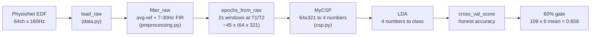
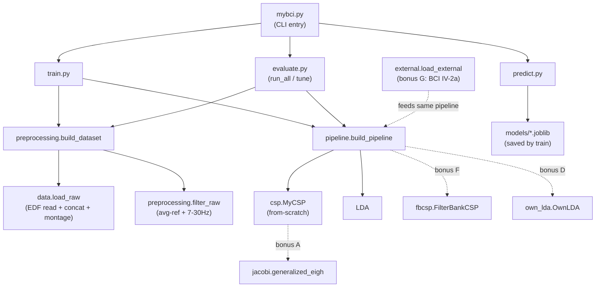
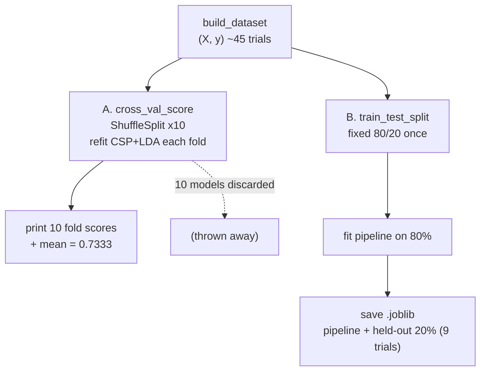
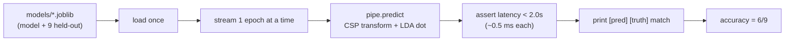
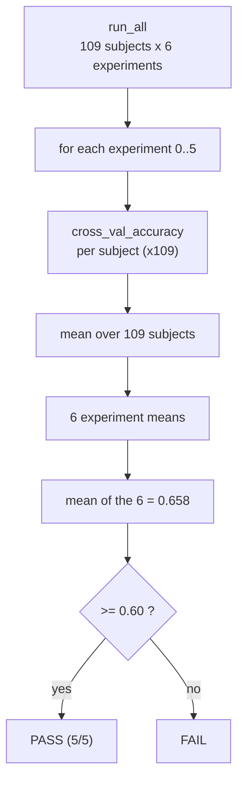
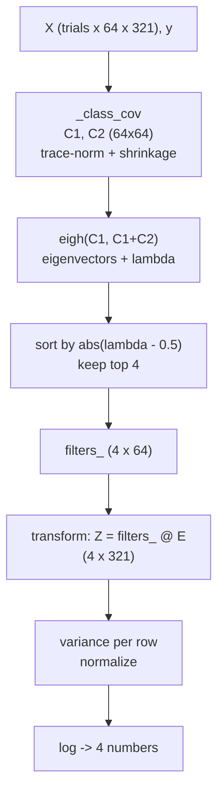
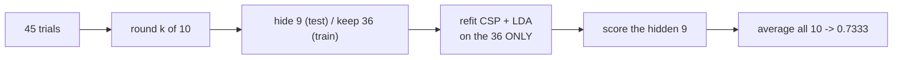
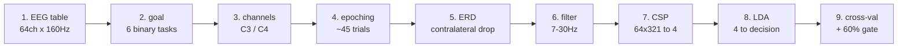
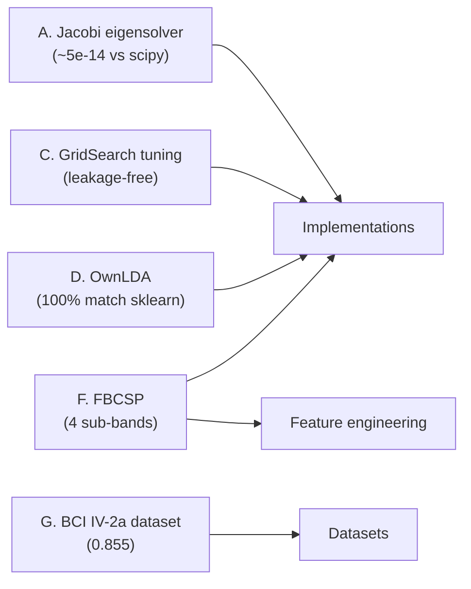

# Workflows — 한눈에 보는 흐름도

> 프로젝트의 모든 흐름을 **다이어그램**으로 정리했습니다. GitHub에서 이 파일을 열면 아래 Mermaid 블록이 **그림으로 자동 렌더링**됩니다.
> 개념 설명은 [`defense-qa-ko.md`](defense-qa-ko.md) / [`defense-qa-en.md`](defense-qa-en.md), 수학 심화는 [`defense-guide.md`](defense-guide.md) 참고.

---

## 1. 전체 파이프라인 (raw 신호 → 점수)

원본 EEG가 점수가 되기까지의 큰 흐름입니다.

---

## 2. 모듈 구조 (어떤 파일이 무엇을 부르나)

CLI 입구부터 각 모듈이 호출되는 관계. 점선은 보너스 경로.

---

## 3. Train 모드 — 독립적인 두 갈래 (A 채점 / B 저장)

`train`은 **채점(A)**과 **모델 저장(B)**을 둘 다 합니다. 둘은 별개의 80/20 분할입니다.

- **A** = 정직한 점수(60% 게이트가 쓰는 값), 만든 모델은 전부 버림.
- **B** = predict가 굴릴 실제 모델 + predict용 시험지 9개.

---

## 4. Predict / Realtime 모드 — 스트림 시뮬레이션

저장된 모델로, 처음 보는 9문제를 **하나씩** 예측 (이벤트당 < 2초).

---

## 5. Score — 60% 게이트 (run_all)

109명 × 6실험을 채점해 **실험 유형별 평균(6개) → 그 6개의 평균**.

---

## 6. CSP 내부 (fit + transform)

직접 구현한 핵심. 공분산 → 고유분해 → 상위 4 필터 → 로그-분산.

- **lambda = a/(a+b)** = 그 필터 출렁임이 한 클래스로 쏠린 비율 (0.5에서 멀수록 좋음).
- 보너스: `eigh`를 자작 `jacobi.generalized_eigh`로 교체 가능 (scipy와 ~1e-14 일치).

---

## 7. 교차검증 + 누수 방지 (한 fold의 안)

매 fold가 **새로** CSP+LDA를 학습분으로만 학습 → 시험 데이터를 미리 못 봄.

- CSP가 Pipeline 첫 단계라 fold마다 재학습됨 → **누수 없음** (누수 시 1.0 vs 정상 0.844).

---

## 8. 개념 9단계 (배움의 지도)

평가·이해를 위한 개념 순서.

---

## 9. 보너스 5개 → 평가표 항목 매핑

---

> **요약**: 위 1~9번 그림이 이 프로젝트의 전체 동작·구조·평가 흐름 전부입니다. 디펜스 때 화면에 띄워 두면 흐름 질문에 바로 답할 수 있어요.
